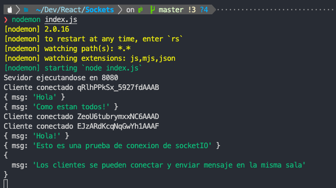

# Template for express and socket io server

This is an example from socket IO and express server

## Scripts

start: Run de server

note: Need to create .env file with **PORT** variable

### Dependencies

* **cors**: 2.8.5
* **dotenv**: 16.0.1
* **express**: 4.18.1
* **socket.io**: 4.5.0

#### Running Server

### Log or server:

